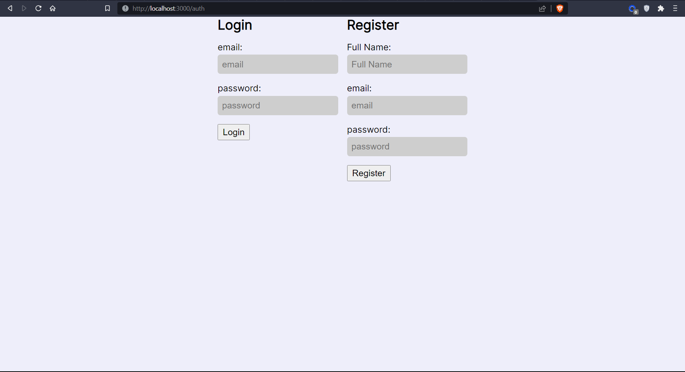
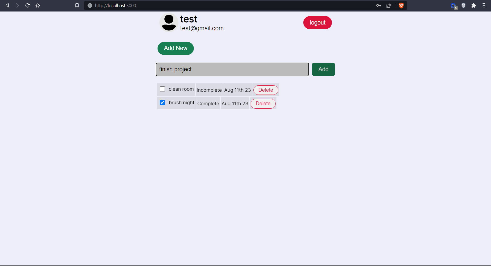

# Full Stack ToDo App built with MERN stack

Here is a step-by-step guide that will take less than 2 minutes to run this project locally on your machine. &#x1F60A;
<br></br>
Note: Almost no-efforts were put into designing the UI. Complete focus was on making it functional.<br></br>
To checkout my designing skills, visit https://padhakoo.in/

## Installation

1. Clone the repository or download the zip file:

    ```sh
    git clone https://github.com/sulekaustubh/mern-task.git

    ```

2. Enter the backend directory:

    ```sh
    cd backend
    ```

3. Install the backend npm modules/dependencies:

    ```sh
    npm i
    ```

4. Run the backend server:

    ```sh
    nodemon index.js
    ```

5. Open a new terminal and enter the frontend directory:

    ```sh
    cd frontend
    ```

6. Install the frontend npm modules/dependencies:

    ```sh
    npm i
    ```

7. Run the frontend server:

    ```sh
    npm run dev
    ```

## You can signup & login



## You can add tasks, and delete them as well, or mark them as complete

